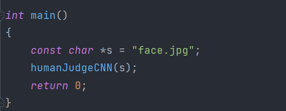
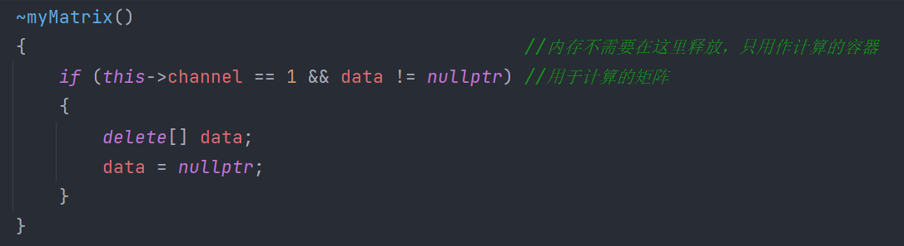

# CS205	C/C++Program Design - Project 5

 [TOC]

## 姓名：张琦

## 学号：12010123

## 日期：2021.12.16

##  Part 1 - 分析问题

### 1.1 : 任务

1. 完成关于人脸识别的卷积神经网络（CNN）的前部（forward part）的设计。于老师在GitHub上提供了CNN后部训练获得的参数。所以完成前部的设计就可以实现人脸识别。

2. CNN的输入必须是一个3x128x128大小的矩阵，输出结果是一个2x1大小的向量。向量包含两个浮点数，**一个浮点数用于表示输入图片的背景的得分，也就是该图片不是人的概率。** **另一个浮点数用于表示输入图片的人脸得分，也就是该图片是人的概率。**两个得分加起来应该趋近于1。

3. 在实现基本功能后，对程序进行优化，可以从**运行时间，报错提示，代码可读性，鲁棒性、可复用性和可移植性**改善。

4. 和Project4类似，需要分别在X86和ARM平台对程序进行测试，比较程序在两个平台运行的区别。

### 1.2 基本思路与具体实现

#### 	1.2.1 前言与大致流程

​	在接触Project5之前，我对人工智能、机器学习和卷积神经网络可以说是一窍不通。为了读懂Project5的文档和老师下发的Introduction PPT, 我学了一整天吴恩达老师的《机器学习》课程，最后发现有些大题小做了。

​	我们需要完成的工作其实并不复杂，其实就是进行大量的子矩阵的卷积计算，再将结果累加起来。CNN真正复杂的是后部的参数训练过程，如果想要完全理解参数训练，激活函数，偏差值，卷积运算，各种回归的原理，需要很深厚的数学功底和机器学习的相关知识，这些在本次project中不做要求。

​	Project2,3中我们实现了并加速了矩阵乘法，Project4中我们编写了能重载操作符和进行ROI的矩阵类，这次project应该需要用上**矩阵乘法**。

​	本次Project我实现了使用矩阵乘法和不使用矩阵乘法的两种方式实现矩阵的卷积运算，两种实现方式的基本原理是相同的，处理方式也只有细微的区别，但是结果存在很大的差异，区别将在下文进行分析。

​	下文将介绍本次project我的CNN的设计细节，包括**设计模式的选择**，**CNN中类与结构体的设计**，**CNN中的内存管理**，**函数传入参数的检验**，**不使用矩阵乘法实现卷积操作**(Case1)，**使用矩阵乘法实现卷积操作**（Case2）。

​	相关的参数：


​	大致流程：（没有画出偏移值、激活函数和Softmax）


​	**如果我们把一个Blob比作一个立方体，整个CNN的流程就是把立方体拉长，最后展平，再压缩成两个数值，就得到我们的结果。**


#### 1.2.1 CNN设计模式的选择以及相关的项目文件

​	为了完成本次Project，我学习了一下于老师在Github上维护的人脸识别项目的源码的设计模式，将CNN分成了五个文件：

上图为于老师的文件划分，下图为Project5的文件划分：


头文件：

1. `humanJudgeCNN-parameter.hpp `  其实就是老师提供的参数文件的复刻，存放的是提供的训练过的参数和相关的结构体。**为了方便访问，我将所有的参数的结构体数组都定义为 `static`类型的全局变量，使得这些参数在5个文件中可以被任意访问。**

   

2.  `humanJudgeCNN.hpp    `存放了所有函数的声明，CNN需要使用的一些类和结构体，所有需要引入的头文件和一些常用的宏定义。**函数声明需要存在一定的顺序否则编译器在调用函数时可能会出现函数未定义的错误**。

   类和结构体的详细说明在下文。在该文件中引入所有需要的头文件，再让其他的源文件引入 `humanJudgeCNN.hpp   `，可以避免头文件重复引入的错误。

   ​	宏定义案例（防止重复引入头文件和用于比较大小的宏）：

   

3. `humanJudgeCNN-function.cpp` 存放了所有的函数的定义。相关的函数的作用将在下文实现卷积操作的部分详细说明。

4. `humanJudgeCNN-model.cpp` 只存放了一个函数：`humanJudgeCNN`，这个函数是我们卷积神经网络的骨架（模型），函数将顺序执行卷积层，最大池化层和全连接层并输出最后的结果。

   这里的datablob数组的写法也是学习了于老师的项目，虽然浪费了一些空间（浪费了5个datablob的空间），**但是其实这些datablob需要的空间非常小，真正消耗空间的是我们申请的用于存储数据的堆上的内存，datablob只是存储了指向这些内存的指针，指针只有8个字节长度。**

   此外，这种写法会使得层与层之间的数据传输过程变得非常清晰，**方便检错还提高了代码的可读性**。

   最后，**这种写法还提高了可代码的可复用性，降低了代码维护的难度：如果需要操作更加复杂的CNN，例如卷积层和池化层的数目不再是个位数，这种写法的代码只需要修改数组的长度并在CNN中添加已经定义好的层操作就可以完成代码的维护，是符合我们要求的优秀代码**。


5. `humanJudgeCNN.cpp`只存放了一个主函数，就只是一个**用户接口**，本次proj的重点是卷积操作的处理，所以这里没有考虑用户的体验问题。

   
   
   

#### 	1.2.2 CNN使用的自定义类与结构体

头文件`humanJudgeCNN.hpp    `中总共定义了三个类：

分别是`DataBlob`类、`myMatrix`类和`Filter`类。

##### 	1.2.2.1 Datablob类

   ​	Datablob是层与层之间进行数据传递的最小单元，是从于老师项目中的概念。**Datablob和矩阵类非常相似，但是规定Datablob在CNN中只起数据传输的作用（只能用于暂存数据），不能做任何的算数操作改变成员。卷积操作通过myMatrix来完成。**通过Datablob来实现层与层之间的数据传递可以提高代码的可读性。此外每一层操作前程序都会严格检验Datablob的行数和列数，判断当前的Datablob的数据量是否等于理论计算值，如果出错程序会立即终止，保证了层与层之间的数据传输在数据量上不会出错，提高了程序的鲁棒性。


   ​	由于本次project5的数据不会超过int的范围，可以不使用size_t 来记录的行数和列数。在c和c++当中等效 **long long unsigned int**，在这里使用int节约了空间。如果需要拓展，修改为size_t即可

   ​	因为数据在传输过程中是不存在DataBlob的深拷贝或者浅拷贝的，为了防止出错，删除了DataBlob类的拷贝构造器和赋值构造器。

   ​	由于第一个DataBlob不是通过层与层之间传输获得的数据，而是通过读入图片来获取数据的，所以第一个Datablob采用特殊的构造器来进行初始化：


   其中标准化函数`float *standardization(const char *path) `将openCV读入的图片转化为存储了3通道长128宽128数据的float类型指针，通过这个指针来初始化第一个Datablob。标准化调用了OpenCV的resize函数，将图片转化为了指定大小的3通道矩阵（本质上是一个一维数组，等效于一个**Z字遍历的二维数组**）。

​	cv::mat在X86平台下会把图形像素转化为一个`unsigned char`类型的数（ARM平台下应该是`signed char`），在初始化操作中读取的每一个像素除以255.0并存入一个一维数组当中，将像素标准化一个范围在[0.0,1.0]的`float`类型数。


​		成员函数 **float operator()(int x, int y, int c) const** 、 **void clear()** 以及**析构函数**在下文有介绍。

##### 	1.2.2.2 Filter类

   ​	Filter存储了每一层计算时所需要的一系列参数，包括进入通道数，离开通道数，当前层填充数，当前层步长，当前层卷积核大小等等。其实仅仅得到最终的结果是不需要此类的，因为参数文件中的conv_param结构体已经记录了这些信息所以直接使用conv_param结构体也是可以的，但是为了方便维护和CNN模型的可读性，还是选择设计了一个Filter类来存储参数。	

   ​	Filter类同样不会用到拷贝，同时Filter类不会在堆中开辟内存空间，直接删除了Filter类的拷贝构造函数和赋值构造函数。

注：**这里的num_kernel等效于文档中的out_channel、channels等效于文档中的in_channel**。

##### 	1.2.2.3 myMatrix类

​	myMatrix类就是Project4当中的矩阵类的低配版，由于内存管理上存在问题，我没有直接使用Project4的矩阵类，删除了一些可能使用不到成员函数，例如加减操作运算符的重载和矩阵的ROI操作。


​	myMatrix是卷积操作当中的最小单元。本次proj中的两种实现卷积操作的方法都会使用到myMatrix，区别在于是否使用矩阵乘法和成员访问函数。

​	正常的CNN中是不会出现myMatrix的赋值操作的，所以删除了myMatrix类的赋值构造函数，选择使用默认的拷贝构造函数。

​	成员函数 **float operator()(int x, int y, int c) const **用于返回通道c的第x行，第y列的元素：


​	成员函数 float **ptr**(int x, int y) const 只有在myMatrix的通道数为0时才有效。


#### 	1.2.3 内存管理上的细节

##### 	1.2.3.1 防止内存溢出

关于datablob：	

​	在三个层的数据传输过程中，旧的DataBlob在结束该层的数据传输过程后就会被主动调用析构函数释放掉申请的内存空间。**保证每一次传输过程结束后，内存中始终只有一块我们主动申请的内存空间，可以防止内存溢出**。

​	正如上文所提到的，为了防止出现内存问题，**我们删除两个类的拷贝构造函数和赋值构造函数，只要存在非法的拷贝操作，程序会立即停止**。

Datablob的clear（）函数：

​															

卷积层、池化层和全连接层函数在返回布尔值前对旧的datablob数据的释放：


关于myMatrix：

​	 在不需要矩阵乘法的卷积操作下（Case1），myMatrix只用作计算的容器，内存不需要在这里释放，内存的释放在Datablob中完成。

​	在需要矩阵乘法的卷积操作下（Case2），需要为im2col的右矩阵新开辟一块内存空间（下文有详细原因），但这块内存空间是临时的，离开卷积层时就应该释放掉，所以我们的析构函数按通道数分类。

​	**如果当前矩阵只有一个通道，那么这个矩阵一定是用于Case2计算的矩阵（我们只处理3通道的RGB图片），矩阵的析构函数需要释放自己指针成员指向的内存空间**



##### 	1.2.3.2 防止内存重复释放

​	养成好的内存释放习惯，即**在释放内存后指向内存的指针设置为nullptr，添加判断条件，可以防止内存的重复释放**


#### 1.2.4 传入参数的检验（Do parameter checking in functions）

​	将所有的进行运算的函数都设置为返回bool类型，**在进行运算前先检验待计算的参数是否是合法的**。若不合法，打印相关的错误信息，直接返回false。若合法，完成相关的计算操作，并返回true。

​	**将传入的用于只读的参数定义为const类型，用于修改的参数不作要求。**

​	以Case2的Conv的矩阵乘法为例：


​	由于const关键字，修改myMatrix中的数据是非法的，可以防止出错。函数开始时先检验左矩阵的列数是否等于右矩阵的函数，如果不相等，直接返回false并打印相应的错误信息。只有左矩阵的列数等于右矩阵的函数时，才向目标内存中填入数据，防止出错。

​	**这里应该是还需要 检验传入参数是否为空、申请内存是否成功、符合要求的 ，但是由于时间缘故，没有实现这两个检错功能，也没有找到传入参数为空和申请内存失败的情景（cv有图片的大小限制，太大的图片resize为128x128会出错）**


#### 1.2.5 卷积层Conv_Case1：不借助矩阵乘法实现卷积操作（指针偏移）

**最开始着手做CNN的时候我还没有意识到我们应该使用矩阵乘法，所以先写了一个不用矩阵乘法的版本：**

注：

1. 获得卷积后长度和宽度的公式：


**其中w0是卷积操作前datablob的宽度，P是填充数，k是卷积核的size，s是步长**

2. 这里的过滤器filter指的是**多个多通道卷积核**，即一个**filter包含多个多通道的kernel，而且他们的通道数都是相同的**。

这里我们只介绍具体的实现方法，分析和与Case2的比较在第三部分。

由于我们的步长stride只有1和2两种情况，填充padding只有0和1两种情况,所以可以使用暴力的分类讨论。

**先考虑步长为2，填充为1的情况**：

float *data是用于存储计算结果的一维数组，data的元素个数是 out_channel * result_rows * result_cols。 

​	**由于填充数为1，我们等效于在原矩阵上添加了一圈0.0f，再做卷积操作，但是直接在原矩阵上添加一圈数对于已经申请好的内存来说非常难实现，因此我们只在计算时对它们进行处理，不是真的改变内存内元素的值。**

​	先考虑最小的计算单元：即**一个单通道子矩阵**和**一个单通道卷积核**的卷积操作

​	如图所示：我们把滑动窗口在原矩阵上的位置可以分为9种情况（默认原矩阵的size远大于kernel）。**滑动窗口的中心能移动到的所有位置的个数就是待填充的一维数组data中的数据的个数**。滑动窗口的中心位置在移动到边界前每一次都移动都只需要移动对应的步长，并做一次卷积操作，再将卷积的结果值叠加到一维数组data的对应位置上。


​	再利用**循环**和**指针偏移**依次访问**待计算的原datablob和当前层filter中的每一个对应的单通道子矩阵和一个单通道卷积核**（**用偏移指针切割连续的内存从而访问每一个子矩阵或者卷积核**）。重复上述的操作，就完成对data的填充，再把data设置为新的datablob的数据，释放掉原来的datablob的内存，就完成了一次卷积操作。

**相关问题的处理：**

1. **如何用代码实现9种位置情况的分类**？

函数：**inline int **typeSwitch_p1s2**(const float *curPtr, float *start, int row, int col)**

**因为这个函数会反复调用，直接使用inline关键字减少int类型的拷贝。**

​	编写一个**决定选择类型**的函数，需要传入指向当前的滑动窗口的中心、指向当前的子矩阵头的指针、子矩阵的行数和列数，返回位置的类型。由于已知行数和列数的矩阵存在一定的数学特性，可以根据算数计算确定当前的中心是上述9中情况的哪一种。


​	 2.  **根据位置的类型做相应的计算**：

函数：**inline float **DotProduct_p1s2**(int key, const float *curCentre, float *curKernelHead, int row, int col)**

​	先让指针指向当前计算的单色卷积核的中心，再利用传入的当前窗口的中心通过指针偏移做运算。

​	**等效把当前窗口的元素按Z字展平，再和同样按Z字展平的同样size的单色卷积核做向量的点乘操作**。函数返回点乘的结果值是一个数。

下图是以情况9为例的点乘过程：


**如果不是第九种情况，即窗口中存在填充的元素，只要点乘窗口中在子矩阵内部的元素即可（默认填充后的一圈为0.0f）,原理完全相同**

​	代码过长，这里仅以情况2、情况4和情况9为例（即上方，右下角和中心的情况）

case2：

​	

case4：


case9：


注: 

1.  如果填充数为0，分类使只会出现第九种情况，**因为窗口中不存在不在子矩阵内的元素**。

2. **当步长不为1时，窗口到达边界时要判断窗口中心下一次平移的位置**，到达边界后只平移步长会导致错误。

3. S2 P1的情况要根据原Datablob长宽是奇数还是偶数进行分类。、

4. 关于Relu的实现

   

   直接将小于0的数置为0，为了让算判断条件顺序执行，减少赋值过程，将bool值加入算数运算：

   

   验证结果时中间结果出现的-0可能与这一步操作有关，即与浮点数的最小精度有关。

   5. 考虑避免使用循环体赋值来拷贝。而是使用 **C库函数：memcpy( )** 来拷贝数据。赋值的效率很低。

         ```C++
         void *memcpy(void *str1, const void *str2, size_t n)
         ```

   **但是没有想到只使用一次memcpy而同时完成添加偏移值和激活函数的操作，所以放弃使用了memcpy。（因为就算使用memcpy广播了偏移值，还是要通过for循环来对元素使用激活函数，所以就直接放在一个循环当中完成，效果反而更好）**

#### 1.2.6 卷积层Conv_Case2：借助矩阵乘法实现卷积操作（im2col）

im2col的实现与上述操作类似，但是不需要做类型分类和特殊情况的考虑，具有**普适性**。

​	正如上文提到的，卷积操作就是将若干个对应的窗口和对应的单色卷积核分别展平成一维向量后做点乘操作，再将结果累加到一维数组对应位置的过程。

​	可以想到，由于老师给我们提供过滤器filter本身就是一个按要求排列好的一维向量（一维数组）。所以我们只需要把原矩阵的所有窗口的元素按一定的顺序排列，就可以一次性处理所有窗口和对应核的卷积操作，这就是im2col的思想，其中我们需要借助矩阵乘法。

**矩阵乘法是可以转化为矩阵的卷积操作的**：

​	`Caffe`是一个非常优秀的卷积神经网络框架，Caffe中使用`im2col`来将矩阵乘法转换为矩阵卷积。

**im2col做的事情就是对于卷积核每一次要处理的小窗，将其展开到新矩阵的一行（列），新矩阵的列（行）数，就是对于一副输入图像，卷积运算的次数（卷积核滑动的次数）**。


图片来源： https://blog.csdn.net/dwyane12138/article/details/78449898

​	图中的单通道矩阵列数就是卷积核的 行数x列数 ，行数是卷积核滑动的次数。最后将单通道矩阵根据通道顺序直接排列成一个大矩阵。

​	但是不同框架的访存机制不一样，所以会有行列相反这样的区别。在`caffe`框架下，`im2col`是将一个小窗的值展开为一行，而在`matlab`中则展开为列。这样以来，我们就能将卷积运算转化为矩阵乘法。

​	本次Project由于**Kernel已经是一个一维向量了**，我们应该将这个特性利用起来。所以我们将结果Datablob的通道数（out_channel）作为行数，将原Datablob的通道数 （in_channel）和 kernnel的元素个数（kernelSize * kernelSize）的乘积作为列数，过滤器数据作为矩阵的数据，创建一个Kernel矩阵（通道数为0，因为只用于计算不用于数据存储）：


​	因为**Kernel矩阵的列数与窗口有关**，所以我们把Kernel作为矩阵乘法的**左矩阵**。

**如何构建矩阵乘法的右矩阵？**

图片来源及参考资料： https://blog.csdn.net/mrhiuser/article/details/52672824

假设三通道卷积核的大小是3x3（这里是3个3x3的单位矩阵），现在我们要对一个3通道的4x4的矩阵做卷积操作，现在我们应该把这个矩阵根据窗口来排列成一个能够进行矩阵乘法的右矩阵。（填充为0，步长为1）

当前的4x4三通道矩阵是：


展开方式：依次将相同通道将窗口的元素向右按列排列，从而形成结果矩阵的一个部分：


对每一个通道都进行上述的操作后：


这里的kernel矩阵（也就是左矩阵）只有一行，说明结果Datablob的通道数为1：


将矩阵和右矩阵相乘：


​	**可以观察到由于左矩阵和右矩阵的对应通道是按顺序排列的，所以在做矩阵乘法的时候在结果的同一位置的不同通道的计算结果会叠加在一起，所以完成一次矩阵乘法就完成了这一层卷积层即所有通道的计算，提高了运算的效率。**


**如何用代码构建矩阵乘法的右矩阵？**

函数 **void **oldMatTransform**(myMatrix &oldMat, Filter &ftr, DataBlob &old)** 用于读取old DataBlob中的数据（每一个窗口所对应的一维向量），并将他们按要求排列到矩阵 oldMat当中。

基本流程与Case1的操作基本相同，但是这里重载了操作符（），使其成为Datablob的成员访问函数：


​	**这个成员访问函数是特殊的成员访问函数，可以“访问”到不在Datablob中的元素，如果输入的坐标越界了，函数直接返回0.0f，等效于访问到了填充层的元素**，所以在排列右矩阵的时候不需要像Case1一样根据位置进行分类。

​	如果存在填充，从填充位置开始移动窗口的中心位置，平移的次数就是结果Datablob元素的个数，通过3重循环实现：


​	**应用矩阵乘法**：

​	直接使用project3的矩阵乘法，将左矩阵和右矩阵相乘，再将结果存储到一个一维数组当中（计算结果应该也是一个矩阵，但是这里的矩阵的数据是通过一个一维数组来存储的，所以获得的计算结果直接传入一维数组的对应位置上即可）：


​	和Project3中提到的一样，使用ikj顺序进行矩阵乘法，实现内存寻址优化，由于将数据写入对应位置没有顺序要求，允许不同的数据同时访问同一块内存，所以可以使用多线程加速（这里使用openmp）。

​	得到的一维数组就是该卷积层的计算结果，直接将指针赋给新的Datablob即可。

#### 1.2.7 池化层Pooling（最大池化）

**由于时间缘故，没有找到将矩阵乘法应用到池化层的方法,这里使用指针偏移完成了最大池化。**

最大池化操作就是将原来Datablob的行数和列数都减半，即Datablob的总数据量变为原来的四分之一。

（**这里有个疑问：如果待操作的行数和列数都是奇数，怎么得出最大池化操作的结果呢？**）

​	和上文描述的一样，先申请好新的内存空间，**通过指针偏移确定当前需要操作的子矩阵（定位到当前待操作子矩阵的矩阵头），然后进行一对一的最大池化操作**。

​	这里我只考虑了行数和列数都是偶数的情况，若行数和列数都是偶数，datablob中的元素个数一定是4的倍数：

​								**证明：2k * 2k = 4k^2,  k属于整数，结果为4k^2，一定是4的倍数**


​	将原来datablob的数据4个4个划分，分成若干个4个元素的小组，将每一个小组中最大的元素选出来，再按顺序排列，代码思路与Case1基本相同，也需要考虑边界条件。


#### 1.2.8 全连接层FC和SoftMax操作

本次project全连接层的任务非常简单，就是将得到的结果和一个2x2048的权重矩阵相乘再加上偏移值即可。	

​												**output2x1 = weight2x2048 *input2048x1+bias2x1**

全连接过程：


Softmax操作：


同样可以使用上面提到的矩阵乘法，最后再进行softmax决定两个结果的权重即可，过程简单不再详细解释

 ## Part 2 - 源代码（不包含参数文件）

### 2.1 humanJudgeCNN-model.cpp

   ```C++
   //  ##### 用于存放CNN的3个卷积层函数 和 一个全连接层函数，是CNN的骨架
   #include "humanJudgeCNN.hpp"
   
   using namespace std;
   
   void humanJudgeCNN(const char *path)
   {
   
       clock_t start = clock(); //程序开始计时
   
       DataBlob dataBlobs[10]{}; //因为要使用特殊的初始化 ，浪费第一个空间了
       DataBlob startBlob(path);
       //############  卷积层1  ############//
        convolution_Relu_withoutMatMul(startBlob, dataBlobs[1], 0);
   //    convolution_Relu_withMatMul(startBlob, dataBlobs[1], 0);
       //############  池化层1  ############//
       MaxPooling(dataBlobs[1], dataBlobs[2]);
       //############  卷积层2  ############//
        convolution_Relu_withoutMatMul(dataBlobs[2], dataBlobs[3], 1);
   //    convolution_Relu_withMatMul(dataBlobs[2], dataBlobs[3], 1);
       //############  池化层2  ############
       MaxPooling(dataBlobs[3], dataBlobs[4]);
       //############  卷积层3  ############//
        convolution_Relu_withoutMatMul(dataBlobs[4], dataBlobs[5], 2);
   //    convolution_Relu_withMatMul(dataBlobs[4], dataBlobs[5], 2);
       //############  全连接层  ############//
       float *vector = flatten_FC(dataBlobs[5]);
       softMax(vector);
       //############  结果打印  ############//
       cout << "bg score: " << vector[0] * 100 << " % "
            << ", "
            << "face score: " << vector[1] * 100 << "% " << endl;
   
       clock_t end = clock(); //程序结束用时
       double endtime = (double)(end - start) / CLOCKS_PER_SEC;
       cout << "Total time:" << endtime * 1000 << "ms" << endl; // ms为单位
   }
   
   ```

### 2.2 humanJudgeCNN-function.cpp

   ```C++
   //  ##### 用于存放处理数据的函数
   //只引入头文件即可，防止重复引入头文件
   
   #include "humanJudgeCNN.hpp"
   #include <cmath>
   
   //要写单元测试
   
   //对输入进行初始化步骤之一，压缩图片为目标输入值
   //注： 还没有做输入的检错操作,待功能实现后再写
   
   //应该把所有的数据都存在
   float *standardization(const char *path)
   {
       Mat pre = imread(path);
       Mat temp;
       resize(pre, temp, Size(128, 128), (0.0), (0.0), INTER_LINEAR);
   
       if (temp.channels() != 3)
       {
           cerr << __FUNCTION__ << ":failed. Because image is not a RGB image." << endl;
           return nullptr;
       }
       else
       {
           //访问mat中的元素，将他们存到三个一维数组矩阵里面,然后这个一维数组可以用于proj3数组的初始化
           float *data = new float[3 * 128 * 128]{}; //申请整块内存空间//存储的是子矩阵的矩阵头的指针,方便处理
   #pragma omp for schedule(dynamic)
           for (size_t k = 0; k < 3; ++k) //依次访问 B R G 在mat[i，j]中的元素
           {
               for (size_t i = 0; i < 128; ++i)
               {
                   for (size_t j = 0; j < 128; ++j)
                   {
                       data[k * 128 * 128 + i * 128 + j] = temp.at<Vec3b>(i, j)[k] / 255.0;
                   }
               }
           }
           return data;
       }
   }
   
   inline int Convert(int old, int pad, int stride, int kernelSize)
   {
       int temp = (old + 2 * pad - kernelSize) / stride;
       return temp + 1;
   }
   
   //第0层卷积运算 ，p = 1 , S = 2, K = 3
   
   //一一对应的卷积运算,传入的是当前的矩阵头，当前权重矩阵头，结果矩阵的位置,传入当前的计算的矩阵序号，一共有 ker_num * channel个结果矩阵
   
   //这一步都是代码实现是相同的，为了少debug，应该写成类似模板的形式
   
   bool MaxPooling(DataBlob &old, DataBlob &result)
   {
   
       if (old.rows % 2 != 0 || old.cols % 2 != 0)
       {
           cerr << __FUNCTION__ << ":failed. The old blob's row# or col# is not even" << endl;
           return false;
       }
   
       //类似一个2 X 2的卷积操作
   
       result.rows = old.rows / 2;
       result.cols = old.cols / 2;
       result.channels = old.channels;
       float *data = new float[(old.channels * result.rows * result.cols)]{};
   
   #pragma omp for schedule(dynamic)
       for (size_t i = 0; i < old.channels; i++)
       {
           float *ptr1 = old.data + i * old.rows * old.cols;   //当前通道的原始矩阵头
           float *ptr2 = data + i * result.rows * result.cols; //当前通道的结果矩阵头
           myMatrix oldMat(old.rows, old.cols, 0, ptr1);       //防止声明中的释放内存，0是特殊用法
           myMatrix newMat(result.rows, result.cols, 0, ptr2);
   
           OneByOneMaxPooling(oldMat, newMat);
       }
   
       result.data = data;
   
       old.clear();
       return true;
   }
   
   void OneByOneMaxPooling(const myMatrix &oldMat, myMatrix &newMat)
   {
       float *ptr = oldMat.data;
       int oldCol = oldMat.col;
   
       for (size_t i = 0; i < newMat.row * newMat.col; i++)
       {
           if (i != 0)
           {
               if ((ptr - oldMat.data + 2) % oldCol == 0) //抵达边界,不再执行 += 2 操作, 列数一定是偶数
               {
                   ptr += oldCol + 2;
               }
               else
               {
                   ptr += 2;
               }
           }
           float max = MAX(MAX(*ptr, *(ptr + 1)), MAX(*(ptr + oldCol), *(ptr + 1 + oldCol)));
   
           newMat.data[i] = max;
       }
   }
   
   bool convolution_Relu_withMatMul(DataBlob &old, DataBlob &result, int layer)
   {
       if (old.isEmpty())
       {
           cerr << __FUNCTION__ << ":failed. The old blob is Empty" << endl;
           return false;
       }
       else
       {
           Filter ftr(layer);
           result.channels = ftr.num_kernel;
           result.rows = Convert(old.rows, ftr.padding, ftr.stride, ftr.kernelSize);
           result.cols = Convert(old.cols, ftr.padding, ftr.stride, ftr.kernelSize);
   
           float *data = new float[ftr.num_kernel * result.rows * result.cols]{};
   
           myMatrix Kernel(ftr.num_kernel, ftr.channels * ftr.kernelSize * ftr.kernelSize, 0, ftr.data);
           float *MatrixData = new float[result.rows * result.cols * ftr.channels * ftr.kernelSize * ftr.kernelSize]{};
   
           cout << result.rows * result.cols * ftr.channels * ftr.kernelSize * ftr.kernelSize << endl;
   
           myMatrix oldMat(ftr.channels * ftr.kernelSize * ftr.kernelSize, result.rows * result.cols, 0, MatrixData);
           oldMatTransform(oldMat, ftr, old); //加入矩阵乘法再转化一下就行了
           mat_mul_conv(Kernel, oldMat, data);
   
           result.data = data;
   
           for (size_t j = 0; j < ftr.num_kernel * ftr.kernelSize * ftr.kernelSize; j++)
           {
               size_t cur_num_kernel = j / ftr.kernelSize * ftr.kernelSize;
   
               data[j] += ftr.bias[cur_num_kernel]; // >0 为1 小于等于0 为0 不满足条件
               //先加上bias，再对结果做激活
   
               data[j] = (data[j] > 0) * data[j]; //这里由于类型转化会出现 -0
           }
           ///没有想到怎么用广播函数同时做偏移和激活操作，放弃使用
   
           delete[] MatrixData;
   
           old.clear();
   
           return true;
       }
   }
   
   bool mat_mul_conv(const myMatrix &left, const myMatrix &right, float *data)
   {
       if (left.col != right.row)
       {
           cerr << __FUNCTION__ << ":failed. Left mat's # cols is not equal to right mat's rows." << endl;
           return false;
       }
   
   #pragma omp for schedule(dynamic)
   
       for (long long i = 0; i < left.row; i++)
       {
           for (long long k = 0; k < right.row; k++)
           {
               float s = left.data[left.col * i + k];
               for (long long j = 0; j < left.col; j++) // mat1.col == mat2.
               {
                   data[right.row * i + j] += s * right.data[right.col * k + j];
               }
           }
       }
   
       return true;
   }
   
   void oldMatTransform(myMatrix &oldMat, Filter &ftr, DataBlob &old)
   {
       int result_rows = Convert(old.rows, ftr.padding, ftr.stride, ftr.kernelSize); // 64
       int result_cols = Convert(old.cols, ftr.padding, ftr.stride, ftr.kernelSize); // 64
   
       int stride = ftr.stride;
       int padding = ftr.padding;
   
       size_t rows = oldMat.row;
       size_t cols = oldMat.col;
       size_t index = 0;
   
       int x = -padding; //当前点
       int y = -padding;
   
       for (size_t i = 0; i < result_rows; i++)
       {
           x += stride;
           for (size_t j = 0; j < result_cols; j++)
           {
               y += stride;
               for (size_t k = 0; k < ftr.channels; k++)
               {
                   oldMat.data[index++] = old(x + 0, y + 0, k);
                   oldMat.data[index++] = old(x + 0, y + 1, k);
                   oldMat.data[index++] = old(x + 0, y + 2, k);
                   oldMat.data[index++] = old(x + 1, y + 0, k);
                   oldMat.data[index++] = old(x + 1, y + 1, k);
                   oldMat.data[index++] = old(x + 1, y + 2, k);
                   oldMat.data[index++] = old(x + 2, y + 0, k);
                   oldMat.data[index++] = old(x + 2, y + 1, k);
                   oldMat.data[index++] = old(x + 2, y + 2, k);
               }
           }
       }
   }
   
   bool convolution_Relu_withoutMatMul(DataBlob &old, DataBlob &result, int layer)
   {
       if (old.isEmpty())
       {
           cerr << __FUNCTION__ << ":failed. The old blob is Empty" << endl;
           return false;
       }
       else
       {
   
           ///卷积部分有一点点错误 下次修改就能够实现功能了
           Filter ftr(layer);
           //进行卷积操作
   
           result.rows = Convert(old.rows, ftr.padding, ftr.stride, ftr.kernelSize); // 64
           result.cols = Convert(old.cols, ftr.padding, ftr.stride, ftr.kernelSize); // 64
           result.channels = ftr.num_kernel;                                         // 16
   
           //不需要记录channel的间隔，因为row和col就可以计算出channel_STEP
           size_t blobsize = result.rows * result.cols;
           //直接为目标Blob申请内存
   
           //通道数貌似是多余的
   
           float *data = new float[ftr.num_kernel * blobsize]{};
   #pragma omp for schedule(dynamic)
           for (size_t i = 0; i < ftr.num_kernel; i++) // i划分的是来自不同卷积核的矩阵，里面包含多通道的每一个单色卷积核，也就是一个矩阵
           {
               //当前结果的第一个卷积核的头矩阵
               float *curData = data + i * blobsize;
               myMatrix curMat(old.rows, old.cols, old.channels, old.data);
               float *ptr = ftr.data + i * ftr.channels * 3 * 3; //指向当前BRG卷积核矩阵的矩阵头，应该只有9个的大小，9是卷积核的size
               myMatrix kernelMat(3, 3, ftr.channels, ptr);
               OneByOneConvolution(curMat, kernelMat, ftr, curData, blobsize);
           }
   #pragma omp for schedule(dynamic)
   
           for (size_t j = 0; j < ftr.num_kernel * blobsize; j++)
           {
               size_t cur_num_kernel = j / blobsize;
   
               data[j] += ftr.bias[cur_num_kernel]; // >0 为1 小于等于0 为0 不满足条件
               //先加上bias，再对结果做激活
   
               data[j] = (data[j] > 0) * data[j]; //这里由于类型转化会出现 -0
           }
           ///没有想到怎么用广播函数同时做偏移和激活操作
   
           result.data = data;
   
           old.clear(); //释放掉old的内存空间
           return true;
       }
   }
   
   // ftr中含有当前卷积层操作的参数,row和col是输入blob的数据 , 这里的data和上面的不是同一个
   void OneByOneConvolution(const myMatrix &curMat, const myMatrix &curKernel, const Filter &ftr, float *data,
                            size_t blobSize)
   {
   
       int stride = ftr.stride;
       int padding = ftr.padding;
       if (padding == 1 && stride == 2) // hard version
       {
           if (curMat.row % 2 == 0)
           { // r 、 l是偶数
               for (size_t i = 0; i < ftr.channels; i++)
               {
                   //当前通道的两个子矩阵头
                   float *curMatHead = curMat.data + i * curMat.row * curMat.col; //如何判断当前中心有没有界限？把八个界限的地址位置找出来
                   float *curKernelHead = curKernel.data + i * 3 * 3;
                   float *curCentre = curMatHead;
                   for (size_t j = 0; j < blobSize; j++) //用于填充data，但是只修改了一部分data
                   {
                       if (j != 0)
                       {
                           if ((curCentre + 2 - curMatHead) % curMat.col == 0) // stride 2的处理, 向下也是跳2格
                           {
                               curCentre += curMat.col + 2;
                           }
                           else
                           {
                               curCentre += 2;
                           }
                       }
                       int key = typeSwitch_p1s2(curCentre, curMatHead, curMat.row, curMat.col);
                       data[j] += DotProduct_p1s2(key, curCentre, curKernelHead, curMat.row,
                                                  curMat.col); //没有把矩阵的ROI用进去很可惜，知道要用！！！！
                   }
               }
           }
           else
           { ////r、l是奇数
               for (size_t i = 0; i < ftr.channels; i++)
               {
                   //当前通道的两个子矩阵头
                   float *curMatHead = curMat.data + i * curMat.row * curMat.col; //如何判断当前中心有没有界限？把八个界限的地址位置找出来
                   float *curKernelHead = curKernel.data + i * 3 * 3;
                   float *curCentre = curMatHead;
   
                   for (size_t j = 0; j < blobSize; j++) //用于填充data，但是只修改了一部分data
                   {
                       if (j != 0)
                       {
                           if ((curCentre + 1 - curMatHead) % curMat.col == 0) // stride 2的处理, 向下也是跳2格
                           {
                               curCentre += curMat.col + 1;
                           }
                           else
                           {
                               curCentre += 2;
                           }
                       }
                       int key = typeSwitch_p1s2(curCentre, curMatHead, curMat.row, curMat.col);
                       data[j] += DotProduct_p1s2(key, curCentre, curKernelHead, curMat.row,
                                                  curMat.col); //没有把矩阵的ROI用进去很可惜，知道要用！！！！
                   }
               }
           }
       }
       else if (padding == 0 && stride == 1)
       { // ez version{
           for (size_t i = 0; i < ftr.channels; i++)
           {
               //当前通道的两个子矩阵头
               float *curMatHead = curMat.data + i * curMat.row * curMat.col;
               float *curKernelHead = curKernel.data + i * 3 * 3;
               float *curCentre = curMatHead + curMat.col + 1;
               for (size_t j = 0; j < blobSize; j++) //用于填充data，但是只修改了一部分data
               {
                   if (j != 0)
                   {
                       if ((curCentre + 2 - curMatHead) % curMat.col == 0) // stride 2的处理, 向下也是跳2格
                       {
                           curCentre += 3;
                       }
                       else
                       {
                           curCentre += 1;
                       }
                   }
                   data[j] += DotProduct_p1s2(9, curCentre, curKernelHead, curMat.row,
                                              curMat.col); //没有把矩阵的ROI用进去很可惜，知道要用！！！！
               }
           }
       }
       else
       {
           cerr << __FUNCTION__ << ":failed. The padding or stride is incorrect." << endl;
       }
   }
   
   //只需要实现卷积核为3的情况,找到当前kernel的计算结果
   
   //没有使用Project4的矩阵，因为当时功能实现的时候有问题
   
   inline float DotProduct_p1s2(int key, const float *curCentre, float *curKernelHead, int row, int col)
   {
   
       //等效两个channel为1的矩阵在做运算
       //这里很难debug
   
       float *curKernelcentre = curKernelHead + 4; //定位到当前curKnernel的中心,3x3的矩阵
       float a = 0;
   
       switch (key)
       {
       case 1:
   
           a += *curCentre * *curKernelcentre;
           a += *(curCentre + 1) * *(curKernelcentre + 1);
           a += *(curCentre + col) * *(curKernelcentre + 3);
           a += *(curCentre + col + 1) * *(curKernelcentre + 4);
           break;
   
       case 2:
   
           a += *(curCentre - 1) * *(curKernelcentre - 1);
           a += *curCentre * *curKernelcentre;
           a += *(curCentre - 1 + col) * *(curKernelcentre + 2);
           a += *(curCentre + col) * *(curKernelcentre + 3);
           break;
   
       case 3:
           a += *(curCentre - col) * *(curKernelcentre - 3);
           a += *(curCentre + 1 - col) * *(curKernelcentre - 2);
           a += *curCentre * *curKernelcentre;
           a += *(curCentre + 1) * *(curKernelcentre + 1);
           break;
   
       case 4:
           a += *curCentre * *curKernelcentre;
           a += *(curCentre - 1) * *(curKernelcentre - 1);
           a += *(curCentre - col) * *(curKernelcentre - 3);
           a += *(curCentre - 1 - col) * *(curKernelcentre - 4);
           break;
   
       case 5:
           a += *(curCentre - 1) * *(curKernelcentre - 1);
           a += *curCentre * *curKernelcentre;
           a += *(curCentre + 1) * *(curKernelcentre + 1);
           a += *(curCentre - 1 + col) * *(curKernelcentre + 2);
           a += *(curCentre + col) * *(curKernelcentre + 3);
           a += *(curCentre + 1 + col) * *(curKernelcentre + 4);
           break;
   
       case 6:
   
           a += *(curCentre - col) * *(curKernelcentre - 3);
           a += *(curCentre + 1 - col) * *(curKernelcentre - 2);
           a += *curCentre * *curKernelcentre;
           a += *(curCentre + 1) * *(curKernelcentre + 1);
           a += *(curCentre + col) * *(curKernelcentre + 3);
           a += *(curCentre + 1 + col) * *(curKernelcentre + 4);
           break;
   
       case 7:
   
           a += *(curCentre - 1 - col) * *(curKernelcentre - 4);
           a += *(curCentre - col) * *(curKernelcentre - 3);
           a += *(curCentre - 1) * *(curKernelcentre - 1);
           a += *curCentre * *curKernelcentre;
           a += *(curCentre - 1 + col) * *(curKernelcentre + 2);
           a += *(curCentre + col) * *(curKernelcentre + 3);
           break;
   
       case 8:
   
           a += *(curCentre - 1 - col) * *(curKernelcentre - 4);
           a += *(curCentre - col) * *(curKernelcentre - 3);
           a += *(curCentre + 1 - col) * *(curKernelcentre - 2);
           a += *(curCentre - 1) * *(curKernelcentre - 1);
           a += *curCentre * *curKernelcentre;
           a += *(curCentre + 1) * *(curKernelcentre + 1);
           break;
   
       default: // 9,就是p0S1的情况
   
           a += *(curCentre - 1 - col) * *(curKernelcentre - 4);
           a += *(curCentre - col) * *(curKernelcentre - 3);
           a += *(curCentre + 1 - col) * *(curKernelcentre - 2);
           a += *(curCentre - 1) * *(curKernelcentre - 1);
           a += *curCentre * *curKernelcentre;
           a += *(curCentre + 1) * *(curKernelcentre + 1);
           a += *(curCentre - 1 + col) * *(curKernelcentre + 2);
           a += *(curCentre + col) * *(curKernelcentre + 3);
           a += *(curCentre + 1 + col) * *(curKernelcentre + 4);
           break;
       }
       return a;
   }
   
   inline int typeSwitch_p1s2(const float *curPtr, float *start, int row, int col)
   {
       float *node1 = start;
       float *node2 = start + col - 1;
       float *node3 = node1 + (row - 1) * col;
       float *node4 = node2 + (row - 1) * col;
   
       if (curPtr == node1)
       {
           return 1;
       }
       else if (curPtr == node2)
       {
           return 2;
       }
       else if (curPtr == node3)
       {
           return 3;
       }
       else if (curPtr == node4)
       {
           return 4;
       }
       else if (curPtr > node1 && curPtr < node2)
       {
           return 5;
       }
       else if ((curPtr - node1) % col == 0)
       {
           return 6;
       }
       else if ((curPtr - node2) % col == 0)
       {
           return 7;
       }
       else if (curPtr > node3 && curPtr < node4)
       {
           return 8;
       }
       else
       {
           return 9;
       }
   }
   
   float *mat_mul(myMatrix &mat1, myMatrix &mat2)
   {
       //这里直接用矩阵乘法好像不太适合,因为 mat2.row * i + j的值很大很大，直接数组越界了
       if (mat1.col == mat2.row)
       {
           float *result = new float[mat1.row * mat2.col]{};
   #pragma omp for schedule(dynamic)
           for (size_t i = 0; i < mat1.row * mat2.col; i++)
           {
               int temp = mat1.col * i;
               for (size_t j = 0; j < mat1.col; j++)
               {
                   result[i] += mat1.data[temp + j] * mat2.data[j];
               }
           }
           return result;
       }
       else
       {
           cerr << __FUNCTION__ << ":Can not mul because Mat1's row is not equal to Mat2's column." << endl;
           return nullptr;
       }
   }
   
   ///等效矩阵乘法
   float *flatten_FC(DataBlob &old)
   { //连接成一个 2 * 1的矩阵
   
       if (old.rows * old.cols * old.channels != fc_params.in_features)
       {
           cerr << __FUNCTION__ << ":failed. The old blob is not the required blob." << endl;
       }
   
       float *bias = fc_params.p_bias;
   
       myMatrix input(2048, 1, 0, old.data); //特殊的用法，保证析构函数不会释放内存
   
       myMatrix weight(2, 2048, 0, fc_params.p_weight);
   
       float *result = mat_mul(weight, input); ///这里的行列很重要！
   
   #pragma omp for schedule(dynamic)
       for (size_t i = 0; i < 2; i++)
       {
           result[i] += bias[i];
       }
   
       old.clear();
       return result;
   }
   
   void softMax(float *vector)
   {
       float sum = 0;
   #pragma omp for schedule(dynamic)
       for (size_t i = 0; i < 2; i++)
       {
           sum += exp(vector[i]);
       }
   #pragma omp for schedule(dynamic)
       for (size_t i = 0; i < 2; i++)
       {
           vector[i] = exp(vector[i]) / sum;
       }
   }
   
   ```

### 2.3 humanJudgeCNN.hpp

```c++
//  ####  CNN的头文件

#pragma once
///用于比较大小的宏
#ifndef MIN
#define MIN(a, b) ((a) > (b) ? (b) : (a))
#endif

#ifndef MAX
#define MAX(a, b) ((a) < (b) ? (b) : (a))
#endif

#include <opencv2/opencv.hpp>
#include <iostream>
#include <vector>
#include "humanJudgeCNN-parameter.hpp"
#include <algorithm>
#include <ctime>
#include <omp.h>

#pragma GCC optimize(3, "Ofast", "inline")

using namespace std;
using namespace cv;

float *standardization(const char *path);

// Mat BGRToRGB(Mat &img);

inline int Convert(int old, int pad, int stride, int kernelSize);

inline float DotProduct_p1s2(int key, const float *curCentre, float *curKernelHead, int row, int col);

inline int typeSwitch_p1s2(const float *curPtr, float *start, int row, int col);

//用于进行最小单元计算的结构体,本次proj的行数列数都不会超过,channel step可能很大
class myMatrix //最小单元是一个多核矩阵
{
public:
    int row;
    int col;
    int channel;
    float *data;

    myMatrix()
    {
        row = 0;
        col = 0;
        channel = 0;
        data = nullptr;
    }

    myMatrix(int r, int c, int ch, float *d)
    {
        row = r;
        col = c;
        channel = ch;
        data = d;
    }

    //直接当做二维数组访问,因为循环体从0开始//访问通道C的二维数组[X][Y]的元素
    float operator()(int x, int y, int c) const
    {
        if ((x < 0) || (x > this->row - 1) || (y < 0) || (y > this->col - 1))
        {
            cerr << __FUNCTION__ << ":failed. Because you input row or col is incorrect" << endl;
            return -1;
        }

        if (c < 0 || c > this->channel)
        {
            cerr << __FUNCTION__ << ":failed. Because you input channel is incorrect" << endl;
            return -1;
        }

        else
        {
            return this->data[(c - 1) * row * col + y + this->col * x];
        }
    }

    float &operator()(int x, int y) //重载，默认只有一个通道,减少计算操作
    {

        if (this->channel != 0)
        {
            cerr << __FUNCTION__ << ":failed. Because you input channel is incorrect" << endl;
            return *(float *)NULL;  //返回空引用的做法
        }
        if ((x < 0) || (x > this->row - 1) || (y < 0) || (y > this->col - 1))
        {
            cerr << __FUNCTION__ << ":failed. Because you input row or col is incorrect" << endl;
            return *(float *)NULL;
        }
        else
        {
            return this->data[y + this->col * x];
        }
    }

    float ptr(int x, int y) const //默认只有一个通道,减少计算操作
    {
        if (this->channel != 0)
        {
            cerr << __FUNCTION__ << ":failed. Because you input channel is incorrect" << endl;
            return 0;
        }
        if ((x < 0) || (x > this->row - 1) || (y < 0) || (y > this->col - 1))
        {

            return 0.0f; //等效越界了，直接返回0就可以了
        }
        else
        {
            return this->data[y + this->col * x];
        }
    }

    myMatrix &operator=(const myMatrix &) = delete;

    // myMatrix(const myMatrix &) = delete; //矩阵乘法会用到

    ~myMatrix()
    {                                              //内存不需要在这里释放，只用作计算的容器
        if (this->channel == 1 && data != nullptr) //用于计算的矩阵
        {
            delete[] data;
            data = nullptr;
        }
    }
};

class DataBlob
{ //这里模仿了face的写法，实际类似于proj4的矩阵
public:
    int rows;
    int cols;
    int channels;
    float *data; //实际运算使用的是float类型,但是这里的float*不是连续的，考虑修改构造函数和析构函数,BRG直接放在一起了

public:
    DataBlob() // DataBlob数值的改变只在全连接层和卷积层发生，不需要其他的初始化操作
    {
        rows = 0;
        cols = 0;
        channels = 0;
        data = nullptr;
    }

    DataBlob(const DataBlob &) = delete; //此类不存在拷贝操作

    DataBlob &operator=(const DataBlob &) = delete; //此类不存在赋值拷贝操作

    explicit DataBlob(const char *path) //直接把图像读取的操作内置在初始化blob中了，默认为第一次初始化
    {
        this->data = standardization(path);
        rows = 128;
        cols = 128;
        channels = 3;
    }

    float operator()(int x, int y, int c) const
    {

        if (c < 0 || c > this->channels)
        {
            cerr << __FUNCTION__ << ":failed. Because you input channel is incorrect" << endl;
            return -1;
        }

        if ((x < 0) || (x > this->rows - 1) || (y < 0) || (y > this->cols - 1))
        {
            return 0.0f; //越界直接返回0
        }

        else
        {
            return this->data[(c - 1) * rows * cols + y + cols * x];
        }
    }

    //在卷积操作过程中产生新的DataBlob

    bool isEmpty() const
    {
        if (this->rows == 0 || this->cols == 0 || this->channels == 0)
        {
            return true;
        }
        else
        {
            return false;
        }
    }

    void clear()
    {
        this->~DataBlob();
    }

    ~DataBlob()
    {
        //依次释放掉
        if (this->data != nullptr)
        {
            this->rows = 0;
            this->cols = 0;
            this->channels = 0;
            delete[] this->data; //第一个元素是指向整块内存的头的指针
            this->data = nullptr;
        }
    }
};

//缺点：为了便利后续的计算操作，没有直接使用已有的一维数组，导致访问的内存空间不是连续的
// filter就在参数头文件中，定义好了，但是我们要进行转化
class Filter
{
public:
    int channels;   //当前层过滤器的通道数
    int num_kernel; //当前层过滤器的卷积核数
    int kernelSize; //当前层卷积核的大小
    int padding;    //当前层操作的填充数
    int stride;     //当前层操作的步长
    float *data;    //应该是四维： 卷积核个数 * BRG三通道 * 矩阵
    float *bias;    //最多32个元素，不考虑使用指针了,bias的个数和当前层的核数相同

    explicit Filter(int layer) //将获得的参数转化为过滤器，即多个矩阵 , 打算新开辟内存空间，虽然慢但不容易错
    {
        this->channels = conv_params012[layer].in_channels;
        this->num_kernel = conv_params012[layer].out_channels;
        this->kernelSize = conv_params012[layer].kernel_size;
        this->padding = conv_params012[layer].pad;
        this->stride = conv_params012[layer].stride;
        this->data = conv_params012[layer].p_weight; //记录权重矩阵
        this->bias = conv_params012[layer].p_bias;
    }

    Filter(const Filter &) = delete; //此类不存在拷贝操作

    Filter &operator=(const Filter &) = delete; //此类不存在赋值拷贝操作

    // filter中不存在于堆中开辟的内存
};

bool MaxPooling(DataBlob &old, DataBlob &result);

void OneByOneMaxPooling(const myMatrix &oldMat, myMatrix &newMat);

bool convolution_Relu_withoutMatMul(DataBlob &old, DataBlob &result, int layer);

void OneByOneConvolution(const myMatrix &curMat, const myMatrix &curKernel, const Filter &ftr, float *ptr, size_t blobSize);

void humanJudgeCNN(const char *path);

float *mat_mul(myMatrix &mat1, myMatrix &mat2);

float *flatten_FC(DataBlob &old);

void softMax(float *vector);

void oldMatTransform(myMatrix &oldMat, Filter &ftr, DataBlob &old);

bool mat_mul_conv(const myMatrix &left,const myMatrix &right, float *data);

bool convolution_Relu_withMatMul(DataBlob &old, DataBlob &result, int layer);
```

### 2.4 humanJudgeCNN.cpp

```c++
//  ##### 最终CNN的执行文件，用于测试，主函数所在的地方
#include "humanJudgeCNN.hpp"
// #include "humanJudgeCNN-parameter.hpp"

int main()
{
    const char *s = "face.jpg";
    humanJudgeCNN(s);
    return 0;
}
```

## Part3 - 测试与评价

### 3.1 CNN的准确性的验证

先测试一下CNN的准确性：

X86平台下做的测试：

| 测试图片                                                     | 图片说明                       | 人脸得分     | 背景得分   |
| ------------------------------------------------------------ | ------------------------------ | ------------ | ---------- |
|  | 于老师提供的人脸图片           | 99.2914%     | 0.708574 % |
|  | 于老师提供的背景图片           | 0.000375079% | 99.9996 %  |
|  | 刚考完的英语六级考试的完形填空 | 5.6916e-06%  | 100 %      |
|  | 于老师本人                     | 98.8839%     | 1.11606 %  |
|  | 码代码码到自闭的猫猫           | 56.8023%     | 43.1977 %  |
|  | “你爹来啰”表情包               | 69.4827%     | 30.5173 %  |

​	**可以看出这个模型对人脸的检验还是比较精确的，遇到一些拟人化的动物或者表情包时，图片人脸的得分都不会有真的人脸得分高，可以说人脸得分达到90的话，这张图片基本代表的就是真的人了。**


### 3.2 X86平台下Case1与Case2两种卷积方法速度的比较：

以同一张图片，face.jpg，即上面于老师提供的人脸图片作为测试对象：

**这里存在一个疑问，为什么每一次检测同一张人脸（照片）所需要的时间都不同？**

由于每一次的运行时间都不同，我们在这里分别运行十次再取平均值比较一下：

都是在**O3编译优化**和**OpenMP**的加速环境下测试的时间：

|   Case1   |   Case2   |
| :-------: | :-------: |
| 600.191ms | 36.2559ms |
| 809.311ms | 29.6298ms |
| 494.708ms | 32.2757ms |
| 855.201ms | 29.1459ms |
| 839.119ms | 34.6939ms |
| 731.237ms | 27.7172ms |
| 583.745ms | 42.5414ms |
| 474.876ms | 36.9834ms |
| 488.498ms | 31.3211ms |
| 494.428ms | 31.4031ms |

​	Case1（指针偏移）的平均值约等于**638ms**，而Case2（im2col）的平均值约等于**33ms**。**由于两种测试只有卷积层的实现存在区别，即有无使用矩阵乘法。所以ikj矩阵乘法将人脸识别的速度提升了接近20倍（比值为19.3333）。我深深地感受到了好的算法对程序运行时间的影响。**


### 3.3 在ARM平台下测试CNN并比较与X86平台的区别

不同于上一次proj，这次我们使用clion连接华为远程服务器：


连接成功后，直接在clion中内置的命令行交互：


​	这里为了方便调试，这里我并没有把源代码所在的文件夹上传到Arm服务器上，而是直接使用clion通过华为云服务器运行了我们的源代码。

**准确性测试：**

**老师的文档中强调了char类型在x86和arm平台上的区别，所以我在不修改源文件的情况下特意比较了一下两个下face.jpg人脸和背景的得分。**

**可以发现arm平台下和x86平台下两项得分是完全相同的，可能是因为cv在arm架构下读取图片也是存储为unsigned char 类型，所以不影响**

arm平台下结果（case1）：


x86平台下结果（case1）：

​					

​									**这里有一个疑问,老师为什么要强调char类型的区别?**

在Arm平台下的速度测试：

​	同样以老师提供的face.jpg作为测试对象：

|  case1   |   case2   |
| :------: | :-------: |
| 10.181ms |  2.543ms  |
| 10.174ms | 2.54875ms |
| 10.168ms | 2.53725ms |
| 10.179ms | 2.54475ms |
| 10.128ms | 2.5435ms  |
| 10.174ms |  2.542ms  |
| 10.19ms  | 2.5485ms  |
| 10.176ms | 2.54525ms |
| 10.158ms | 2.54725ms |
| 10.15ms  | 2.54675ms |


​	指针偏移实现卷积所需要的时间接近10ms，而矩阵乘法实现卷积所需要的时间接近2.5ms，比值约为4。case2所需要的时间仍然比case1少。

​	**令人惊奇的是，在arm平台下指针偏移实现卷积的算法加速了接近64倍，而矩阵乘法算法只加速了15倍。**

​	**在上一次的project4中，我同样测试了计算2048 x 2048矩阵在arm平台和x86平台所需要的的时间，ARM平台测试的时间接近X86平台所需时间的三倍。但这一次arm平台反而比x86平台快了64倍，这让我难以理解。**

​	此外X86平台下测试同一张图片所需要的时间存在严重的上下波动现象，每一次测试的结果都存在很大的差异，有的数据甚至存在百位的差异。**arm平台虽然每次测试同一张图片也不相同，但是每一次测试的结果差别很小，最多也只有十分位的差异，不知道是因为计算时间本身缩短了60余倍引起的，还是arm平台有这样的特性。**


