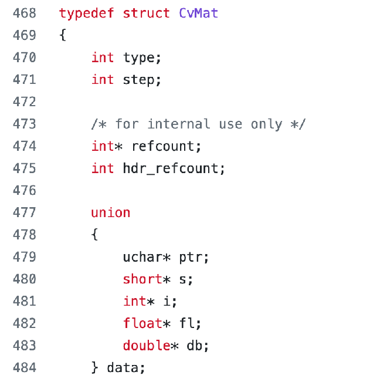
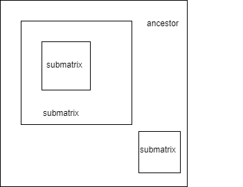
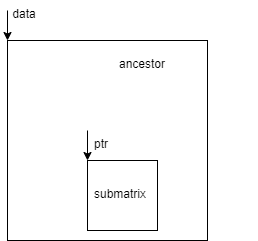
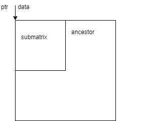
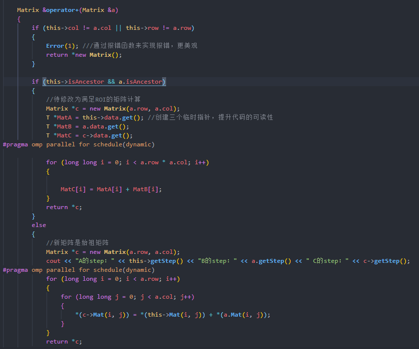
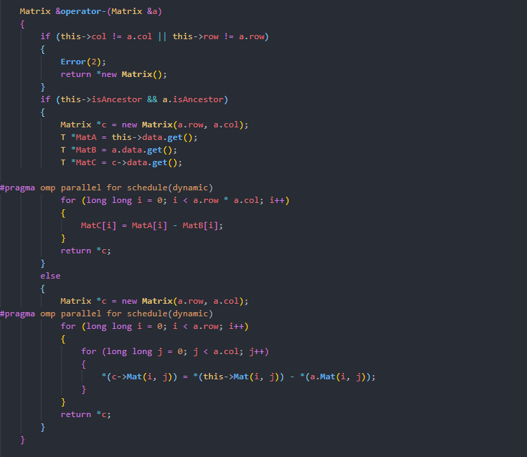
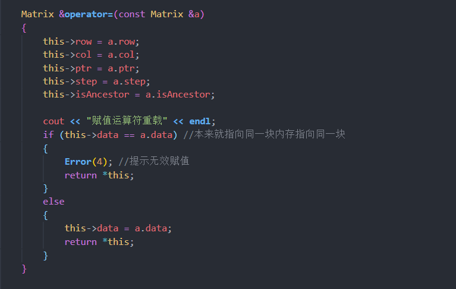
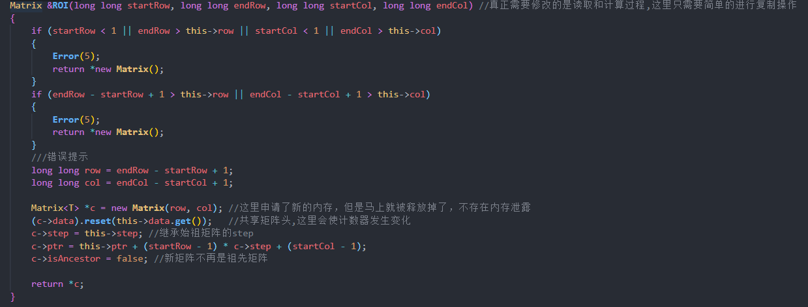
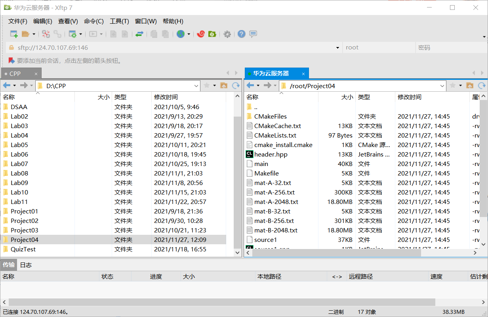

# CS205	C/C++Program Design - Project 4

 [TOC]

## 姓名：张琦

## 学号：12010123

## 日期：2021.11.22

##  Part 1 - 分析问题

   ### 			1.1 : 任务

1. 使用C++设计一个矩阵类，矩阵类需要支持多种数据类型。至少包括`unsigned char` , `short `, `int` , `float` ,` double`。
2. 不能利用内存硬拷贝来将一个矩阵对象赋值给另一个矩阵对象。即重载赋值操作符时，要防止内存的硬拷贝，避免内存泄漏和内存重复释放的风险。
3. 矩阵类的成员要至少包括要行数（rows），列数（columns）和通道数（channels），
4. 重载一些常用的运算符，至少包括`=` ,`== `,` +`, `-`,` *`
5. 实现感兴趣部分 region of interest (ROI) 来避免内存硬拷贝。
6. 分别在X86和ARM平台上运行矩阵类，比较两个平台的区别。


   ### 			1.2 我的基本思路与具体实现

####        1.2.1 矩阵类需要支持多种数据类型

​	Project中提示让我们参考一下OpenCV中Mat类的做法

​	于老师上课有提到，OpenCV由于兼容性问题，矩阵类在实现支持多种数据类型方面并没有使用太多C++的高级特性。CvMat结构体选择使用Union来支持多种数据类型。在union 中所有的数据成员共用一个空间，同一时间只能储存其中一个数据成员，所有的数据成员具有相同的起始地址。矩阵结构体通过`union data`用来存储数据，通过成员`int type`用来存储矩阵的数据类型。在使用矩阵时，通过数据类型的字节长来切割的这一段连续内存，从而依次访问不同数据类型的矩阵的成员。

图片来源：CPP Lecture11 、CPP  Lecture5




​                                                                              

​                                                                                               

​	但是这样处理内存的话，在实现矩阵ROI（ region of interest ）时，会相当复杂。因此我放弃使用Union来支持多种数据类型。

​	接着我尝试使用了void *，但是void *的动态内存管理很不好操作，总是出现一些难以理解的错误，于是放弃。也尝试分开定义的5个类，将他们分别定义在不同的头文件中，然后通过宏来选择具体使用哪一个头文件。但是这样做没法实现一个函数当中同时存在多个不同数据类型的矩阵，如果某代码出错或者我们想要给矩阵类添加新的功能，我们需要维护的代码量将会非常巨大。

我最后还是选择使用C++的新特性 -- 模板类（template）


使用模板的优点在于：

1. 编译器会自己根据用户键入的数据类型来生成对应的模板，维护工作轻松很多。
2. 代码实现比union、void*简单很多，有了模板类的帮助，我们在实现矩阵的功能时，几乎不用再考虑矩阵支持不同数据类型的问题，直接将问题简化了。

使用模板的缺点在于：

1. 用户在使用矩阵的时候还是要遵循C++ 模板类的使用语法，要先确定矩阵的类型，即在类后加上数据类型，如< int >、< float >。部分编程水平不够高的用户使用起来可能不是很方便。

2. 模板类成员函数存在定义问题：函数实现不能定义在源文件中，一定要在头文件中。

   参考资料：(博客)：https://blog.csdn.net/jinzeyu_cn/article/details/45795923

原因：因为模板类需要在使用到的地方利用声明模板的typename或者class参数的时候，才会即时生成代码。那么当我们把模板声明和实现分开的时候，这个即时过程因为编译器只能通过代码include“看到”头文件而找不到模板实现代码，所以会产生链接问题。为了方便，我把所有的成员函数都定义在类当中。

**这也是为什么这一次project我选择只提交一个源文件和一个头文件。**


#### 	1.2.2 矩阵类成员的选择和实现过程

​	最开始我并没有考虑ROI、channel和内存软拷贝的问题，矩阵类的成员变量只有：

```c++
private:   
	long long col;
    long long row;
    T *ptr;
```

​	更新后的矩阵类的成员变量：

```c++
private:
    long long col;
    long long row;
    long long step;
    shared_ptr<T> data; /// shared_ptr用于记录始祖矩阵的矩阵头
    T *ptr;
    bool isAncestor = true; //不做任何操作，默认是祖先矩阵
    //int channel;//可能放置在类外实现           
```

​	考虑到要实现ROI，即子矩阵的内存空间共用，为了避免内存的重复释放。我在这里用一个智能指针`shared_ptr data`来记录每一个当前矩阵的始祖矩阵的矩阵头，这里简称为数据头，用一个普通指针`T * ptr`来记录当前矩阵的矩阵头，这里简称为矩阵头。

​	**始祖矩阵的定义：如果一个矩阵的内存没有被另一个子矩阵共用，则该矩阵是始祖矩阵。始祖矩阵的智能指针`shared_ptr data`和指针`T * ptr`指向同一个内存地址。非始祖矩阵的`shared_ptr data`和指针`T * ptr`不一定指向同一块地址。不是始祖矩阵的矩阵被称为子矩阵**

子矩阵（非始祖矩阵）和始祖矩阵的关系  

  

子矩阵中数据头和矩阵头的位置关系：

   									                            

注：只有ROI操作才会产生子矩阵。本矩阵类的设计时，将拷贝构造函数（Copy Constructor）设计为了内存硬拷贝，而赋值运算符重载（Copy Assignment）则设计为内存软拷贝，原因将在下文分析）

​	因为非始祖矩阵的数据头`shared_ptr data`和矩阵头`T * ptr`也可能指向同一块内存空间。例如我们在进行ROI操作时，选择挖取矩阵的第一行到第二行，第一列到第二列，按照上面的定义这个2X2的新子矩阵的数据头和矩阵头是值相同一块内存空间的。因此我们还需要引入一个`bool`成员变量来判断这个矩阵到底是不是始祖矩阵。若是始祖矩阵 `bool isAncestor = true`，若不是始祖矩阵`bool isAncestor = false`。

图片：子矩阵数据头和矩阵头也可能指向同一块内存空间



​	是否是始祖矩阵将决定当前矩阵在进行`+ - *`和` show（打印）`操作时，处理的内存数据是否是连续的。始祖矩阵的数据一定是连续的，而非始祖矩阵的数据是离散的。面对连续和离散的数据，运算符重载时应该选择不同的乘法方式，具体实现将在下文介绍。

​	最后成员 `int channel `用于决定矩阵的通道数。根据OpenCV用户的使用习惯，在处理图像数据RGB三原色的选择是最多的。所以这里我们的矩阵类只实现1通道和3通道的矩阵。实现的原理也非常简单，如果某个矩阵对象的通道数不是1，那么它的通道数只能是3，相当于这个矩阵是有三层数据的，即该矩阵遇到每一个算数方法都会执行三次。这里可以将一个三通道的矩阵视为是3个单通道矩阵的集合。用一个指针` Matrix*`来记录这三个单通道矩阵的内存地址，进行各种操作时，通过这个指针依次访问这三个单通道矩阵，就相当于实现实现了三通道矩阵。

​	由于时间关系，本project最后没有实现`int channel `作为矩阵成员变量的版本，在这里仅提供了个人的思路。

####        1.2.3 矩阵类的内存管理

​	C++内存管理是一个比较重要的一个话题，好的内存管理可以**增加程序的鲁棒性，提高运行效率以及合理有效的利用有限的内存空间**。（来源：《C++内存管理》）

​	内存管理常见的问题主要有**内存重复释放**和**内存泄露**。

##### 1.2.3.1 如何避免内存的重复释放？

​	在阅读上文时，你可能会有这样的疑问？为什么作者要选择用一个`shared_ptr`来记录当前矩阵的数据头，而不是直接使用普通指针。

原因是智能指针可以在适当时机自动释放分配的内存。在我们使用智能指针前，我们的析构函数通常只有一个释放当前矩阵已经分配内存的语句。如果我们用一个普通的指针来记录当前矩阵的数据头，且该矩阵是一个存在子矩阵的始祖矩阵。当这个子矩阵调用析构函数时，由于两个矩阵的部分数据是共享的，始祖矩阵的内存也会被释放。当始祖矩阵再调用析构函数时，一定会出现内存重复释放的错误。

​	当我们使用`shared_ptr`来指向每一个矩阵的数据头时，由于`shared_ptr`有内置的计数器，当多个`shared_ptr`指向同一块内存空间而矩阵的析构函数被调用时，这块内存不会被释放，而是内置计数器的计数 - 1。当`shared_ptr`的计数器置为0时，它才会释放这块内存，这样以来我们就避免了ROI操作下内存重复释放的问题。


首先可以证明，尽管我们在创建智能指针时传入的是一个指向堆的一块内存空间的指针，智能指针还是可以帮助我们释放这块内存的。

​	下面的案例是：这三个地址都是我们在堆中申请的内存。当我们提前手动释放了其中一块内存的空间时，程序在结束后会报内存重复释放错误，这说明矩阵在调用最后一次析构函数时（智能指针的计数器清0时），智能指针会释放在创建时接收的指针所指向的内存空间，只是这一操作在程序结束后才完成，难以检验。

​	由于设计矩阵的构造函数时保证了每一个申请空间的指针都有一个对应的智能指针来帮助释放这一块内存，所以我们并不需要在析构函数当中手动释放申请的内存空间。


所以这是我在使用智能指针前的析构函数:

​       


使用智能指针后的析构函数：

​        

​         

选用`shared_ptr`后的测试代码以及对应的内存释放过程：

在矩阵的析构函数中打印删除当前矩阵后，还有多少个指针指向当前矩阵的数据头：


可以看到有两个指针指向`0x55fddf2a7eb0`这个内存地址，但是内存释放过程中没有出现内存重复释放的错误，可以证明我们的想法是正确的。

##### 1.2.3.2 如何避免内存泄漏？

​	本次Project中余老师强调了内存管理的重要性。为了更好地对矩阵类的对象进行内存管理，我们应该避免使用编译器提供的默认拷贝构造函数（Default Copy Constructors）和默认的赋值运算符函数（Default Copy Assignment），小心地处理类的拷贝构造函数和赋值运算符重载。

​	本节只介绍拷贝构造函数的处理方式，赋值运算符的处理在运算符重载的部分。

​	尽管这次project我们应该尽量避免内存的硬拷贝（avoid memory hard copy), 首先题目要求我们在**赋值重载函数**中实现内存的**软拷贝**，在多次尝试之后我发现如果矩阵的拷贝构造函数不设计为内存硬拷，就算我们使用智能指针帮助我们释放内存，不同矩阵的同一块内存也一定会被释放多次，程序一定会出错。所以我设计的拷贝构造函数仍然实现的是内存硬拷贝。

​	这里的设计存在缺点，如果程序在一些极端的情况反复调用超大型矩阵的拷贝构造函数，可能会使内存溢出（memory leak），由于时间关系，我没有找到在兼顾**ROI操作**和**赋值重载函数软拷贝**的前提下将拷贝构造函数设计为内存软拷贝而不出错的方法，是一个遗憾。

**优化前的测试（默认构造函数）：**


程序出错内存的重复释放：


**优化后的测试：**

优化后的拷贝构造函数：


测试样例以及结果：


可以看到这个测试样例包含了所有可能出现的情况，即始祖拷贝拷贝，子矩阵拷贝子矩阵。

在智能指针的帮助下，程序没有出现内存管理上的错误，在矩阵离开作用域后内存也跟着释放了（原因见上文）。

#### 1.2.4 运算符重载的具体实现

##### 1.2.4.1 + - * 的实现

​	在上文我们定义了两种矩阵，即始祖矩阵和子矩阵。由于我们使用一维数组来存储矩阵的数据，而且所以始祖矩阵的矩阵数据在内存中是连续的，但是子矩阵的矩阵数据在内存中其实是离散的。

​	假设我们创建一个3X3的始祖矩阵A[1,2,3；4,5,6；7,8,9]，对这个始祖矩阵进行ROI操作 `ROI（2,3,2,3）`，即挖去该矩阵的第二行到第三行、第二列到第三列，所以子矩阵B应该为：[5,6,8,9];

正如下面的图片所展示的，A的矩阵数据在内存中是连续的，而B的矩阵数据在内存中是离散的。


​	最开始设计矩阵类运算符重载时，我并没有考虑到ROI操作后，我们需要访问离散的矩阵数据。所以

在设计`+` `-` `*`三种运算时都是默认访问的数据是连续的，这样对于经过ROI操作的子矩阵是不适用的。

**如何按照循环的顺序访问在内存中离散的数据？找到一个恰当的散列函数(Hash)是关键**

​	通过一个**成员访问函数（Member access function）**，我们按照循环的顺序依次访问子矩阵中离散的数据。在成员访问函数的帮助下，我们可以依次访问离散的数据，计算所需要的时间会增加，但是处理过程等效成操作连续的内存，先前设计的运算符重载函数就变得适用了。

函数 `T * Mat(long long x, long long y) `用于访问矩阵中第x-1行，第y-1列的元素，将矩阵等效成存储在一个二维数组当中。


因此我们根据是否有子矩阵，即通过ROI操作产生的矩阵参与运算来决定我们采取哪种计算方式：

关于 + 与 - 的实现：

+与-非常在实现上基本相同，若只有始祖矩阵参与计算，我们需要访问的数据在内存上是连续的，直接通过一层for循环就可以遍历所有的数据。如果有子矩阵参与计算，则根据成员访问函数来访问离散的矩阵数据，再进行计算。

+ +号的实现：



+ -号的实现：



+ *号的实现（ *号继承了project3中ikj循环和openmp并行执行的做法的做法）：


##### 1.2.4.1 = 的实现

​	project文档中要求将赋值运算符的重载函数设计为内存软拷贝，考虑到使用了智能指针来管理同一块内存。我们应该判断一下等号左右的矩阵是否有相同的矩阵头，否则智能指针的赋值操作可能会导致等号左边的内存没有被释放，造成内存泄露问题（Memory Leak）。所以我们应该调用`shared_ptr` 的 `赋值操作符函数（=）`，它会选择性的释放等号左边的智能指针对象所指向的内存，再将新的指针赋值给智能指针，保证计数平衡。




#### 1.2.5  ROI函数的实现

`Matrix & ROI (long long startRow, long long endRow, long long startCol, long long endCol)`

ROI函数的实现模仿了OpenCV的`rect（）`函数，即传入待挖掘矩阵的起始行终止行，起始列终止列，返回一个目标子矩阵对象的引用。

函数首先会对用户的输入进行输入合法性的判断，如果行数、列数不合法的话，是没法进入赋值阶段的。


​	接着，由于我们在上面实现各种函数的时候都已经考虑了ROI的存在，所以ROI函数本质上就只是简单的赋值以及复制操，真正的数据处理过程都已经在上文完成了。

​	需要注意的是：**我们需要标记新的矩阵对象不再是一个始祖矩阵而是子矩阵，并且子矩阵要继承父矩阵的`step`成员和`data`成员。我们还要根据数学关系更新这个子矩阵的矩阵头，找到新的`ptr`成员 ，此时的数据头与矩阵头可能不再重合。**

ROI函数实现的代码：




#### 1.2.6 其他函数的实现

简单提及一下其他函数的实现。

1. 值得一提的是，本次project的报错使用的是报错函数Error，提高了代码的可读性。通过switch选择错误的分支。


2. show( )函数即矩阵的打印函数采用的时OpenCV式的打印，也是通过矩阵是否为始祖矩阵做的执行分类，代码过长就不放图展示了。

3. 误差检验函数`error accuracyCheck(Matrix<T> A, Matrix<T> B)`，继承了project3用于检验矩阵乘法算法是否正确的误差检验函数。

   构造精度比较辅助函数来判断结果是否准确，对照结果来源于利用`OpenBLAS`矩阵乘法库得到的计算结果。

   ​	百分误差的计算公式：（图片来源：百度百科）

   ​																	

   ​	*a*表示真实值，这里指使用OpenBLAS计算的结果。

   ​	*b*表示*a*的近似值，这里指使用矩阵各种操作符计算的结果

   ​	由数学知识知： 当矩阵的尺寸很大时，最大百分误差和平均百分误差均小于0.00001%，而当矩阵的尺寸很小时，最大百分误差和平均百分误差趋近于0，说明矩阵之间的差别非常小，可以说两矩阵相同。此时说明我们的算法是正确的的


### 1.3 我的操作环境

- 操作系统：`Linux`/`Linux`
- 编译器：`gcc 9.3.0`/`gcc 7.3.0`
- CPU: `I7-10750H 2.60GHZ` / `未知`
- 操作平台： `X86 / ARM `


##  Part 2 - 源代码

### 2.1 Source1.cpp

**source1.cpp没有参考价值，只是一段测试用的数据**

```c
#include <cstdlib>
#include <iostream>
#include <string>
#include "header.hpp"
#include <sys/time.h>
using namespace std;


int main(int argc, char **argv)
{

#pragma omp parallel for schedule(dynamic)

    struct timeval start, end;

    const char *filename1 = argv[1];
    const char *filename2 = argv[2];
    const char *filename3 = argv[3];

    FILE *fileprt = NULL;

    // float *result = (float *)malloc(matrix1.row * matrix2.col * sizeof(float));

    float *a = read_matrix(fileprt, filename1);
    float *b = read_matrix(fileprt, filename2);
    Matrix<float> mat1(2048, 2048, a);
    Matrix<float> mat2(2048, 2048, b);

    gettimeofday(&start, NULL);
    Matrix<float> mat3 = mat1 * mat2;
    Matrix<float> mat4 = mat1 + mat2;
    Matrix<float> mat5 = mat1 - mat2;
    // write_matrix(mat3, fileprt, filename3);
    gettimeofday(&end, NULL);

    long timeuse = 1000000 * (end.tv_sec - start.tv_sec) + end.tv_usec - start.tv_usec;

    printf("The Required Time = %f Seconds\n", timeuse / 1000000.0);
}


```

### 2.2 header.hpp

```cpp
#include <iostream>
#include <omp.h>
#include <time.h>
#include <cstdlib>
#include <memory>
#include <stdio.h> //输入输出
#include <stdlib.h>
#include <string.h>
#include <math.h>

using namespace std;
void Error(int key);
typedef struct error

{

    float max;

    float average;

} error;

template <class T>
class Matrix
{
private:
    long long col;
    long long row;
    long long step;
    shared_ptr<T> data; /// shared_ptr用于记录始祖矩阵的矩阵头
    T *ptr;
    bool isAncestor = true; //不做任何操作，默认是祖先矩阵
    int channel;            //稍后实现

public:
    Matrix()
    {
        this->row = 0;
        this->col = 0;
        this->step = 0;
        T *temp = new T[0 * 0]();
        this->ptr = temp;
        this->data = shared_ptr<T>(temp);
    }

    Matrix(const Matrix &a) ///拷贝构造函数,区分于赋值操作符重载只能采用硬拷贝
    {

        this->row = a.row;
        this->col = a.col;
        this->step = a.step;
        this->data = shared_ptr<T>(new T[a.row * a.col]()); //默认初始化为0
        this->ptr = this->data.get();
        this->isAncestor = a.isAncestor;
        T *MatA = this->data.get();
        T *MatB = a.data.get();
        for (long long i = 0; i < a.row * a.col; i++)
        {
            MatA[i] = MatB[i];
        }
    }

    Matrix(long long row, long long column, T *elements)
    {
        this->row = row;
        this->col = column;
        this->step = row;
        this->ptr = elements;
        this->data = shared_ptr<T>(elements);
    }

    Matrix(long long row, long long column)
    {
        T *temp = new T[column * row](); //默认初始化为0
        *temp = 0;
        this->row = row;
        this->col = column;
        this->step = row;
        this->ptr = temp;
        this->data = shared_ptr<T>(temp);
    }

    long long getStep()
    {
        return step;
    }

    long long getRow()
    {
        return row;
    }

    long long getColumn()
    {
        return col;
    }

    shared_ptr<T> getData()
    {
        return data;
    }
    T *getptr()
    {
        return ptr;
    }
    bool getIsAncestor()
    {
        return this->isAncestor;
    }

    Matrix &operator+(Matrix &a)
    {
        if (this->col != a.col || this->row != a.row)
        {
            Error(1); ///通过报错函数来实现报错，更美观
            return *new Matrix();
        }

        if (this->isAncestor && a.isAncestor)
        {
            //待修改为满足ROI的矩阵计算
            Matrix *c = new Matrix(a.row, a.col);
            T *MatA = this->data.get(); //创建三个临时指针，提升代码的可读性
            T *MatB = a.data.get();
            T *MatC = c->data.get();
#pragma omp parallel for schedule(dynamic)

            for (long long i = 0; i < a.row * a.col; i++)
            {

                MatC[i] = MatA[i] + MatB[i];
            }
            return *c;
        }
        else
        {
            //新矩阵是始祖矩阵
            Matrix *c = new Matrix(a.row, a.col);
            cout << "A的step：" << this->getStep() << "B的step：" << a.getStep() << " C的step：" << c->getStep();
#pragma omp parallel for schedule(dynamic)
            for (long long i = 0; i < a.row; i++)
            {
                for (long long j = 0; j < a.col; j++)
                {
                    *(c->Mat(i, j)) = *(this->Mat(i, j)) + *(a.Mat(i, j));
                }
            }
            return *c;
        }
    }

    Matrix &operator-(Matrix &a)
    {
        if (this->col != a.col || this->row != a.row)
        {
            Error(2);
            return *new Matrix();
        }
        if (this->isAncestor && a.isAncestor)
        {
            Matrix *c = new Matrix(a.row, a.col);
            T *MatA = this->data.get();
            T *MatB = a.data.get();
            T *MatC = c->data.get();

#pragma omp parallel for schedule(dynamic)
            for (long long i = 0; i < a.row * a.col; i++)
            {
                MatC[i] = MatA[i] - MatB[i];
            }
            return *c;
        }
        else
        {
            Matrix *c = new Matrix(a.row, a.col);
#pragma omp parallel for schedule(dynamic)
            for (long long i = 0; i < a.row; i++)
            {
                for (long long j = 0; j < a.col; j++)
                {
                    *(c->Mat(i, j)) = *(this->Mat(i, j)) - *(a.Mat(i, j));
                }
            }
            return *c;
        }
    }

    Matrix &operator*(Matrix &a)
    {
        if (this->col != a.row)
        {
            Error(3);
            return *new Matrix();
        }
        if (this->isAncestor && a.isAncestor) //两个都是祖先矩阵的时候才适用
        {
            Matrix *c = new Matrix(this->row, a.col);
            T *MatA = this->data.get();
            T *MatB = a.data.get();
            T *MatC = c->data.get();
#pragma omp parallel for schedule(dynamic)
            for (long long i = 0; i < this->row; i++)
            {
                for (long long k = 0; k < a.col; k++)
                {
                    T temp = MatA[this->col * i + k];
                    for (long long j = 0; j < this->col; j++) // mat1.col == mat2.
                    {
                        MatC[a.row * i + j] += temp * MatB[a.col * k + j];
                    }
                }
            }
            return *c;
        }
        else
        {
            //新矩阵新开辟一块内存空间,是内存访问上的问题,两种乘法的结果是一致的
            Matrix *c = new Matrix(this->row, a.col);
#pragma omp parallel for schedule(dynamic)
            for (long long i = 0; i < this->row; i++)
            {
                for (long long k = 0; k < a.col; k++)
                {
                    T *temp = this->Mat(i, k);
                    for (long long j = 0; j < this->col; j++)
                    {
                        *(c->Mat(i, j)) += *temp * *(a.Mat(k, j));
                    }
                }
            }
            return *c;
        }
    }

    Matrix &operator=(const Matrix &a)
    {
        this->row = a.row;
        this->col = a.col;
        this->ptr = a.ptr;
        this->step = a.step;
        this->isAncestor = a.isAncestor;

        cout << "赋值运算符重载" << endl;
        if (this->data == a.data) //本来就指向同一块内存指向同一块
        {
            Error(4); //提示无效赋值
            return *this;
        }
        else
        {
            this->data = a.data;
            return *this;
        }
    }

    bool operator==(const Matrix &a) const
    {
        if (this->row == a.row && this->col == a.col && this->step == a.step && this->data == a.data)
        {
            return true;
        }
        else
        {
            return false;
        }
    }

    void clear()
    {
        this->~Matrix();
    }

    void Reset(long long row, long long column, const T *element)
    {
        this->row = row;
        this->col = column;
        this->data.reset(element);
    }
    // T *ROI(long long rowStart, long long rowEnd, long long colStart, long long col End);

    void show()
    {
        if (this->isAncestor)
        {
            printf("Rows: %lld  Columns:%lld \n", this->row, this->col);
            cout << "[";
            T *Mat = this->data.get();
            for (long long i = 0; i < this->row * this->col; i++)
            {
                if ((i + 1) % this->col == 0) //最后一列
                {
                    if (i != this->row * this->col - 1)
                    {
                        cout << Mat[i] << ";" << endl;
                    }
                    else
                    {
                        cout << Mat[i] << "]" << endl;
                    }
                }
                else
                {
                    cout << Mat[i] << ", ";
                }
            }
        }
        else
        {
            printf("Rows: %lld  Columns:%lld \n", this->row, this->col);
            cout << "[";
            for (long long i = 0; i < this->row; i++)
            {
                for (long long j = 0; j < this->col; j++)
                {
                    if (j != this->col - 1) //不是最后一列
                    {
                        cout << *(this->Mat(i, j)) << ", ";
                    }
                    else //是最后一列
                    {
                        if (i != this->row - 1) //不是最后一行最后一列
                        {
                            cout << *(this->Mat(i, j)) << ";" << endl;
                        }
                        else
                        {
                            cout << *(this->Mat(i, j)) << "]" << endl;
                        }
                    }
                }
            }
        }
    }

    //挖去第r1~r2行、c1~c2列的矩阵，
    Matrix &ROI(long long startRow, long long endRow, long long startCol, long long endCol) //真正需要修改的是读取和计算过程,这里只需要简单的进行复制操作
    {
        if (startRow < 1 || endRow > this->row || startCol < 1 || endCol > this->col)
        {
            Error(5);
            return *new Matrix();
        }
        if (endRow - startRow + 1 > this->row || endCol - startCol + 1 > this->col)
        {
            Error(5);
            return *new Matrix();
        }
        ///错误提示
        long long row = endRow - startRow + 1;
        long long col = endCol - startCol + 1;

        Matrix<T> *c = new Matrix(row, col); //这里申请了新的内存，但是马上就被释放掉了，不存在内存泄露
        (c->data).reset(this->data.get());   //共享矩阵头,这里会使计数器发生变化
        c->step = this->step;                //继承始祖矩阵的step
        c->ptr = this->ptr + (startRow - 1) * c->step + (startCol - 1);
        c->isAncestor = false; //新矩阵不再是祖先矩阵

        return *c;
    }

    T *Mat(long long x, long long y) ///成员访问函数,用于访问矩阵的元素,等效二维数组
    {
        if ((x < 0) || (x > this->row - 1) || (y < 0) || (y > this->col - 1))
        {
            Error(6);
            return 0;
        }
        else
        {
            return getptr() + x * step + y; //返回一个指向这个数据的指针
        }
    }

    ~Matrix()
    {
        cout << "内存地址 " << this->data.get() << "   删除后的引用次数 : " << this->data.use_count() - 1 << endl;
    }
};

void Error(int key)
{

    cout << "Error Type ： " << key << endl;
    switch (key)
    {
    case 1:
        cout << "操作失败, 行数与列数不匹配，不能进行加法，请重试" << endl;
        break;
    case 2:
        cout << "操作失败, 行数与列数不匹配，不能进行减法，请重试" << endl;
        break;

    case 3:
        cout << "操作失败, 行数与列数不匹配，不能进行乘法，请重试" << endl;
        break;

    case 4:
        cout << "操作失败，等号左右的矩阵是完全相同的矩阵，请重试" << endl;
        break;

    case 5:
        cout << "输入的起始行、终止行、起始列或终止列存在错误，结果矩阵已置0，请重试" << endl;
        break;

    case 6:
        cout << "矩阵不存在目标行或目标列，返回0，请重试" << endl;
        break;
    default:
        break;
    }
}

template <class T>
error accuracyCheck(Matrix<T> A, Matrix<T> B)
{
    if (A.row != B.row || A.col != B.col)
    {
        printf("A and B have different size");
        error err;
        err.max = -1;
        err.average = -1;
        return err;
    }
    else
    {
        long long size = A.col * A.row;
        error err;
        err.max = 0;     //峰值
        err.average = 0; //平均值
        for (long long i = 0; i < size; i++)
        {

            // fabs求浮点数x的绝对值
            T delta = fabs(A.elements[i] - B.elements[i]) / B.elements[i];
            if (err.max < delta)
            {
                err.max = delta;
            }
            err.average += delta;
        }
        err.average = err.average / (size);
        return err;
    }
}

//测试时要使用float类型,仅起测试作用，没有开发读取文本写入文本的函数功能

float *read_matrix(FILE *fileprt, const char *filename)
{
    long long row, column = 0;

    fileprt = fopen(filename, "r");

    fscanf(fileprt, "%lld %lld\n", &row, &column);

    // T *elements = (T *)malloc(sizeof(float) * row * column);

    float *elements = new float[row * column]();

    for (long long i = 0; i < row * column; i++)
    {
        fscanf(fileprt, "%f", &elements[i]);
    }

    fclose(fileprt);

    return elements;
}

```


## Part 3 - 分别在X86和ARM平台测试程序

### 3.1 X86平台的测试

​	经过误差检验函数和OpenBLAS对计算结果进行校验，通过相对误差的大小，可以证明我们的各种重载运算符函数的计算结果是正确的。由于这不是我们测试的重点，没有展示具体的测试过程，详细过程可以参考Project3`3.1.计算结果检验`这一部分。

​	查阅资料，我了解到：ARM架构，是一个32位精简指令集（RISC）处理器架构，其广泛地使用在许多嵌入式系统设计。由于节能的特点，ARM处理器非常适用于移动通讯领域，符合其主要设计目标为低耗电的特性。而X86架构（The X86 architecture）是微处理器执行的计算机语言指令集，指一个intel通用计算机系列的标准编号缩写，也标识一套通用的计算机指令集合，目前的PC架构绝大多数都是Intel的X86架构。

​	ARM架构的优点在于低功耗，这是否意味着我们在两个不同平台上对超大型矩阵进行计算时，ARM平台所需要的的时间会比X86平台所需要的时间长？让我们来测试一下。

在X86平台对Project3中2048 x 2048矩阵乘法进行时间测试：


### 3.2 ARM平台的测试

通过Ubuntu 20.04LTS 连接华为提供的远程服务器：


​	远程计算机四Linux系统，支持yum指令安装。yum 这个命令就相当于我们操作手机 中 的应用商店，在其中我们可以实现搜索软件，安装软件，卸载软件等等对软件的管理。通过yum指令我们可以在目标服务器配置C语言/C++的开发环境。

可以看到编译器已经安装成功，查询版本为GCC 7.3.0。


接着安装make和cmake，我们的开发环境就基本搭建完全了。

如果我的CPP文件所在的目录本身就在Linux系统的/home目录下，**可以使用ssh的scp命令上传目录到远程服务器**。

但是为了方便，我在配置Vscode的cpp环境时，没有选择在虚拟机的/home目录下存放CPP文件，而是在我的D盘。

所以我需要**将windows下的文件上传到Linux服务器上**。

在尝试多种方法后，还是选择使用Xftp，Xftp是一个功能强大的SFTP、FTP 文件传输软件。使用了 Xftp 以后，MS Windows 用户能安全地在 UNIX/Linux和 Windows PC 之间传输文件。



从这里我改用 `Windows Terminal`进行操作，`Windows Terminal`因为允许光标在终端上进行复制操作，操作方便一些。

通过ls指令和cd指令查看一下，可以看到我们已经上传成功了。


无法直接执行可执行文件main，系统提示我们没有使用的权限：


键入`sudo chmod -R 777 Project04`为为目录及其子文件添加最高权限，使得我们可以执行它。继续编译目标文件再执行可执行文件。

键入编译和执行指令：

`[root@ecs001-0021-0047 Project04]# g++ source1.cpp -o main`
`[root@ecs001-0021-0047 Project04]# ./main mat-A-2048.txt mat-B-2048.txt`

在ARM平台对Project3中2048 x 2048矩阵乘法进行时间测试：


​	可以看到我们的猜测是正确的。ARM架构适用于嵌入式等小型计算机，低功耗，在计算这种超大型矩阵所需要的时间是比X86架构所需要的时间长的。**但是我们不知道华为云服务器详细的CPU配置，也可能是CPU性能差距导致ARM平台测试的时间接近X86平台所需时间的三倍，和架构无关。**

​	可能是测试样例太少的缘故，我认为X86架构和ARM架构就软件测试而言，除了计算所需的时间外并没有其他明显的区别。值得一提的是X86架构有自适应的加速指令集SDIM，而ARM的加速指令集是Arm Neon。由于时间缘故，我并没有做两种加速指令集对程序加速情况的分析。

## Part 4 - 需要改进的地方

### 4.1 矩阵类需要更加人性化

1. 选择矩阵的数据类型：

​	OpenCV使用Union来支持多种不同的数据类型，矩阵结构体通过`union data`用来存储数据，通过成员`int type`用来存储矩阵的数据类型。在使用矩阵时，通过数据类型的字节长来切割的这一段连续内存，从而依次访问不同数据类型的矩阵的成员。但是这样处理内存的话，在实现矩阵ROI（ region of interest ）时，会相当复杂，要仔细阅读OpenCV的源码才能彻底搞懂它是怎么实现的。因此我放弃使用Union来支持多种数据类型。

​	接着我尝试使用了void *，但是void *的动态内存管理很不好操作，总是出现一些难以理解的错误，于是放弃。也尝试分开定义的5个类，将他们分别定义在不同的头文件中，然后通过宏来选择具体使用哪一个头文件。但是这样做没法实现一个函数当中同时存在多个不同数据类型的矩阵，如果某代码出错或者我们想要给矩阵类添加新的功能，我们需要维护的代码量将会非常巨大。

​	最后还是选择了模板类。用户在使用矩阵的时候还是要遵循C++ 模板类的使用语法，要先确定矩阵的类型，即在类后加上数据类型，如< int >、< float >。部分编程水平不够高的用户使用起来可能不是很方便。模板类成员函数存在定义问题：函数实现不能定义在源文件中，一定要在头文件中。

​	所以用户使用矩阵类要在类后键入类型，不知道模板类语法的用户使用起来可能不是很方便，改进时希望能将决定矩阵类型的关键字定义为构造器的一个形式参数。

2. 初始化矩阵：

​	本矩阵类的初始化操作并不是那么优秀，需要用户自己申请一段内存作为矩阵的成员，才能对矩阵进行初始化操作。**此外，由于模板类的兼容性问题，矩阵类没有实现从现有的txt文档中读取数据，或将矩阵数据写入目标txt文档的功能**, 这些地方都需要改进。

3. 关于多通道（channel）的问题：

   由于时间的缘故，**我没有实现channel作为类成员的矩阵类**，在这里提供一下实现的思路：

   成员 `int channel `用于决定矩阵的通道数。根据OpenCV用户的使用习惯，在处理图像数据RGB三原色的选择是最多的。所以这里我们的矩阵类只实现1通道和3通道的矩阵。实现的原理也非常简单，如果某个矩阵对象的通道数不是1，那么它的通道数只能是3，相当于这个矩阵是有三层数据的，即该矩阵遇到每一个算数方法都会执行三次。这里可以将一个三通道的矩阵视为是3个单通道矩阵的集合。用一个指针` Matrix*`来记录这三个单通道矩阵的内存地址，进行各种操作时，通过这个指针依次访问这三个单通道矩阵，就相当于实现实现了三通道矩阵。

### 4.2 并没有完全解决内存的重复释放和内存泄漏的问题

​	尽管我使用了智能指针来避免内存的重复释放，但是在设计函数类的时候我把拷贝构造函数设计成了内存硬拷贝，而赋值运算符函数定义为了内存软拷贝，在经过了很多次测试后，系统确实没有提示内存重复释放的错误。但是这样处理存在几个缺点。

1. 当操作的矩阵为超大型矩阵时，当程序连续调用拷贝构造器实行内存硬拷贝时，内存可能会不足，导致内存溢出错误，需要优化。
2. 在进行ROI操作的时候，如果对同一个始祖矩阵做多次**同样**（传入的参数完全相同）的ROI操作，智能指针在释放内存的时候还是会报内存重复释放的错误。
3. 没有实现类似java GC机制的功能。这里所谓的回收内存都还是在程序结束后才进行的，如果用户提前手动释放内存，智能指针在最后还是会释放这一块内存，会报内存的重复释放错误，智能指针只是避免了我们重复释放这块内存，不能帮助我们提前释放掉我们不需要的内存（没有垃圾回收的功能）。

